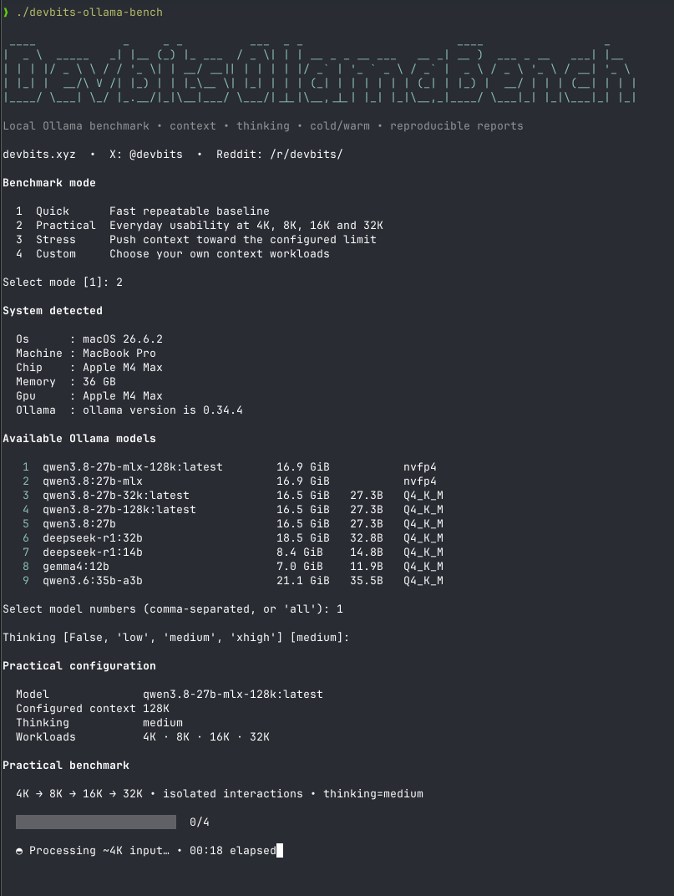

# Devbits Bench

**Benchmark your local AI models without building benchmark scripts.**

Devbits Bench gives you one interactive terminal UI for testing local models
with **Ollama** and **MLX-LM**.

Choose an engine, choose a model, choose how hard you want to test it, and
Devbits Bench handles the benchmark and generates the report.



## Run it

If you cloned the repository:

```bash
./devbits-bench
```

That's it.

Devbits Bench detects the engines and models available on your machine and walks
you through the rest.

### Run it from anywhere

If you'd rather use `devbits-bench` as a normal command, install the cloned
project once:

```bash
python3 -m pip install .
```

Then you can run:

```bash
devbits-bench
```

from any directory.

> You should already have the local inference engine and models you want to test
> installed. Devbits Bench currently supports **Ollama** and **MLX-LM**.

## Choose a benchmark

The interactive UI gives you four modes:

| Mode | Best for |
| --- | --- |
| **Quick** | A fast, repeatable performance baseline. |
| **Practical** | Seeing how the model behaves as context grows from ~4K to ~32K. |
| **Stress** | Pushing context toward the selected limit and watching latency, integrity, and memory pressure. |
| **Custom** | Choosing your own context sizes and workloads. |

### Quick

Start here.

Quick gives you a repeatable baseline for:

- time to first token;
- prompt processing speed;
- generation speed;
- consistency across repeated runs.

It runs a cold baseline, warms the model, and then measures three warm trials.

### Practical

Practical answers a more useful everyday question:

**What happens as I give this model more context?**

It tests approximately:

```text
4K → 8K → 16K → 32K
```

where supported, showing how prompt speed, generation speed, time to first token,
and memory behavior change as the workload grows.

### Stress

Stress is for finding the limits of a configuration.

It progressively tests larger portions of the selected context window and checks
that the model can still recover information from the input correctly.

Large-context tests can take a long time and use substantial memory. Devbits
Bench watches memory pressure and warns you before continuing when appropriate.

If you stop a Stress run with **Ctrl-C**, fully completed stages are preserved in
the generated report.

### Custom

Custom gives you control.

Choose the context sizes you want to test and optionally how much of each context
to fill. This is useful when you want to investigate a specific configuration
instead of following the predefined Practical or Stress workloads.

## Thinking / reasoning

When the selected model supports it, Devbits Bench lets you choose the reasoning
level directly in the UI.

For example:

```text
False
Low
Medium
XHigh
```

Available choices depend on the model and engine.

Keep the same reasoning setting when comparing benchmark results.

## Results

When a benchmark finishes, Devbits Bench shows the important results directly in
the terminal and writes two files:

```text
devbits-bench-YYYYMMDD-HHMMSS.md
devbits-bench-YYYYMMDD-HHMMSS.json
```

The Markdown report is easy to read and share.

The JSON report contains the detailed benchmark data and provenance for deeper
analysis or tooling.

Typical measurements include:

- **TTFT** — time to first token;
- **Prompt tok/s** — prompt/prefill processing speed;
- **Decode tok/s** — generated-output speed;
- **Memory** — memory observations around the workload.

## Comparing results

For meaningful comparisons:

- use the same model and quantization where possible;
- use the same benchmark mode and context;
- use the same thinking/reasoning setting;
- compare runs from machines in similar memory conditions;
- avoid comparing a cold result directly with a warm result;
- keep the generated report with any results you publish.

Different inference engines can handle caching, context, reasoning, and
measurement differently. Devbits Bench preserves that information in its reports
rather than pretending every backend works identically.

## Supported engines

### Ollama

If Ollama is installed and running, Devbits Bench detects it automatically.

### MLX-LM

If MLX-LM is available in your current environment or in a discoverable Python
environment, Devbits Bench detects it automatically.

If Devbits Bench cannot find an MLX-LM installation you already have, activate
that environment first and run Devbits Bench again.

For unusual/custom installations, you can explicitly point Devbits Bench at the
Python interpreter:

```bash
DEVBITS_MLX_PYTHON=/path/to/venv/bin/python ./devbits-bench
```

You do **not** need to start `mlx_lm.server`.

## Command-line options

You don't need command-line options for normal use—the interactive UI is the
recommended way to run Devbits Bench.

To see the available options:

```bash
./devbits-bench --help
```

They are useful for automation and repeatable scripted runs.

## Requirements

- Python 3.10+
- Ollama and/or MLX-LM already installed
- At least one local model to benchmark
- Enough memory for the model and context you choose

## Development

Contributor and implementation details live in:

- [Architecture](ARCHITECTURE.md)
- [Changelog](CHANGELOG.md)

Run the test suite with:

```bash
PYTHONPATH=src python -m unittest discover -s tests -v
```

## License

MIT.

---

**Devbits:** devbits.xyz · X: @devbits · Reddit: /r/devbits/
